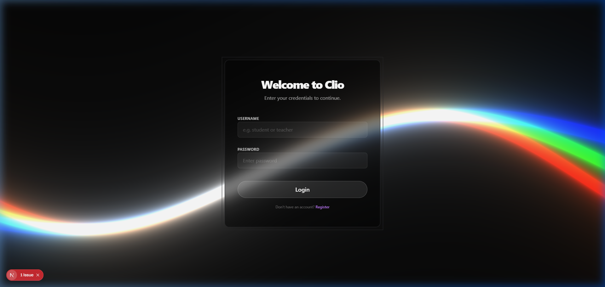

<div align="center">
  
  
  # Clio: Academic Integrity & Authorship Platform

  **Proof of Write > Plagiarism Catcher.** Clio is a modern educational platform designed to verify authorship, protect student work, and enable confident grading through real-time integrity signals and session replay.

  [](https://nextjs.org/)
  [](https://supabase.com/)
  [](https://tailwindcss.com/)
  [](https://opensource.org/licenses/MIT)
  [](http://makeapullrequest.com)
</div>

---

## 📚 Technical Documentations & Due Diligence
For technical contributors, investors, and system administrators, please review our comprehensive architecture and compliance standards:
- [System Architecture & Telemetry Engine](docs/architecture.md)
- [FERPA Readiness & Security Standards](docs/security_and_compliance.md)

---

## 🌟 The Problem & Our Solution
Traditional editors (MS Word, Google Docs) focus solely on content creation, leaving teachers to rely on reactive, often inaccurate AI-checkers after the fact. 

**Clio fills this gap.** It acts as a proactive, monitored environment that discourages copy-paste misuse and supports fair assessment. By tracking typing behavior (WPM, paste events, pacing) to generate an *Integrity Score*, Clio ensures content is authentically written by the student while giving instructors unmatched visibility into authorship behaviors.

---

## ✨ Key Features

### 🎓 For Students (The "Proof of Write")
- **Rich Student Editor**: A beautiful, distraction-free writing environment powered by Tiptap (headings, lists, bold/italic).
- **Live Integrity Signals**: Real-time WPM tracking, paste detection, and an integrity status chip that encourages original thought.
- **Cloud Autosave**: Drafts are safely synced to the cloud, preventing data loss.
- **Optional Spotify Integration**: Connect an account to control playback and support focus without leaving the writing context.
- **Easy Exports**: Download DOCX or PDF directly from the browser.

### 🍎 For Teachers (Confident Grading)
- **Session Replay**: Periodic snapshots of the essay are taken, allowing teachers to play back the entire writing session like a video. Protects students from false AI accusations.
- **Structured Classes & Assignments**: Create classes, enroll students, and assign essays with strict due dates and word count limits.
- **Teacher Dashboard**: 
  - Grouped submission viewer with detailed integrity reports.
  - **Similarity Checking**: Compares student submissions against each other to identify collusion.
  - **Grading Panel**: Assign scores (0-100) and provide rich rubric feedback.
  - **Analytics**: View class-wide trends and integrity score distributions.

---

## 🏗️ Architecture & Tech Stack

Clio uses a secure, modern architecture with strict JWT-based Role-Based Access Control (RBAC) and tight PostgreSQL Row Level Security (RLS). The system cleanly separates responsibilities between the core web platform and the artificial intelligence processing layer.

- **Frontend & Core API**: Next.js 15 (React 19, App Router) handles the UI, authentication, and core CRUD API routes using Serverless functions.
- **AI/ML Layer (Backend)**: FastAPI specifically handles the embedding generation pipeline, natural language processing, and heavy similarity computations to decouple AI inference from the core web backend.
- **Database**: Supabase (Remote PostgreSQL) with `pgvector` integrations.
   - **Indexing Strategy**: Uses HNSW (Hierarchical Navigable Small World) indexing on `pgvector` to ensure similarity checking remains performant and cost-effective at scale.
- **Styling**: TailwindCSS v4 + Shadcn/UI, utilizing Glassmorphism and custom WebGL Shaders.
- **Security**: DOMPurify (XSS protection), bcryptjs (password hashing).

### User Roles
1. **Student**: The end-users submitting essays.
2. **Teacher**: Instructors managing classes, creating assignments, and grading.
3. **System Admin**: Superusers managing the entire platform's accounts.

---

## 🚀 Getting Started

### Prerequisites
- Node.js (v22+)
- Supabase Project (for PostgreSQL database)

### Installation

1. **Clone the repository**
   ```bash
   git clone https://github.com/yashh1321/Clio.git
   cd Clio
   ```

2. **Install Dependencies**
   ```bash
   cd frontend
   npm install
   ```

3. **Environment Variables**
   Create a `.env.local` file in the `frontend` directory and add your Supabase keys:
   ```env
   NEXT_PUBLIC_SUPABASE_URL=your_supabase_url
   NEXT_PUBLIC_SUPABASE_ANON_KEY=your_supabase_anon_key
   SUPABASE_SERVICE_ROLE_KEY=your_supabase_service_role_key
   ```

4. **Run the Application**
   ```bash
   npm run dev
   ```
   Or use the provided batch script on Windows:
   ```bash
   # From the project root
   start-clio.bat
   ```

---

## 📸 Screenshots & Demo

### Demo Video & UI Walkthrough


### Platform Login


---

## 🔒 Privacy & Ethics

- Only lightweight behavioral metrics (paste events, WPM) are collected.
- **No invasive surveillance**: Clio avoids collecting keystroke-by-keystroke data or using invasive webcam proctoring.
- **Empowerment**: Intended to encourage honest writing and protect students, not to punish. Signals help instructors focus their review realistically.

---
<div align="center">
  <i>Built with ❤️ for modern education.</i>
</div>

##  Contributing
We welcome contributions from the open-source community! Please see our [Contributing Guide](CONTRIBUTING.md) and [Code of Conduct](CODE_OF_CONDUCT.md) for details on how to set up the project locally out of Docker and how to submit a Pull Request.
