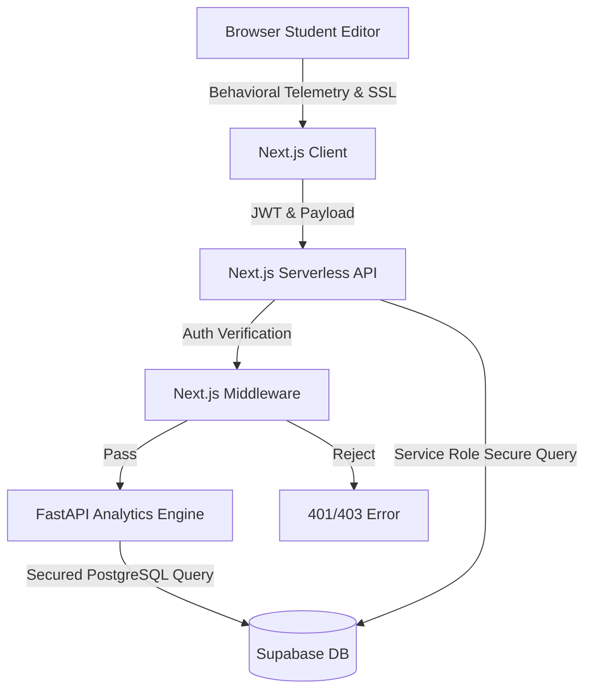

# Clio: System Architecture & Technical Overview

This document provides a high-level architectural overview of Clio, intended for technical due diligence, open-source contributors, and infrastructure partners.

## 1. High-Level Architecture

Clio is designed as a secure, fast, and scalable full-stack web application tailored for the rigor of educational environments. It uses a **decoupled monolithic architecture**, separating the client-side rendering and behavioral telemetry from the backend validation API and database layer.

### Core Stack Strategy
*   **Frontend**: Next.js 15 (App Router), React 19, TypeScript
*   **Backend / Middleware**: Next.js Serverless API Routes (Node.js) & FastAPI (Python 3.11)
*   **Database Engine**: Supabase (Remote PostgreSQL) built on AWS infrastructure.
*   **Telemetry Processing**: Client-side execution with secure batching to reduce server load.

---

## 2. Component Diagram

---

## 3. The "Proof of Write" Telemetry Engine

Traditional plagiarism checkers rely on reactive LLM models that search the web or analyze linguistic entropy *after* text is written. 

Clio leverages **Proactive Telemetry**, capturing data *during* the drafting process.

1.  **Event Capture**: The Tiptap-based React editor captures high-frequency events (`onPaste`, dynamic Keystroke deltas).
2.  **Client-Side Aggregation**: To prevent DDoS-like loads on the server, WPM (Words Per Minute) calculations and Paste Events are aggregated locally in the client state.
3.  **Snapshotting**: Every few minutes, a sanitized HTML snapshot of the editor state is silently saved to the cloud, forming the "Session Replay."
4.  **Submission**: Only upon final submission is the aggregated telemetry payload sent securely via HTTPS to the Next.js API.

---

## 4. Database Schema & Relational Design

The Supabase PostgreSQL database enforces strict relational integrity utilizing Foreign Keys and cascading deletes to prevent orphaned academic records.

### Primary Entities:
*   `profiles`: The foundation. Contains the hashed password and Role (Student/Teacher/Admin).
*   `classes` & `assignments`: Relational hierarchical structures allowing teachers to broadcast requirements.
*   `submissions`: The core payload table storing the final HTML document, linked to `assignments` and `profiles`.
*   `grades`: Relational feedback linked directly to a specific `submission`.

### Why PostgreSQL?
We chose PostgreSQL (via Supabase) over NoSQL (like MongoDB) because academic data requires **ACID compliance**. A student's grade or submission state must be strictly typed, transactional, and historically immutable.

---

## 5. Security & Authentication Model

We built Clio with **Zero-Trust Principles** suitable for EdTech handling sensitive student data.

### JWT Role-Based Access Control (RBAC)
*   Authentication issues an `HttpOnly`, `SameSite=Lax` securely-signed JWT Cookie containing the user's `role` and `uuid`.
*   The Next.js `middleware.ts` runs at the edge. If a `student` attempts to route to `/api/grades/batch` or `/dashboard`, the middleware intercepts the request before it even reaches the server logic, dropping it instantly (403 Forbidden).

### Service Role vs. Anon Key
*   The browser holds the `NEXT_PUBLIC_SUPABASE_ANON_KEY`, but relying on this for critical actions is dangerous if misconfigured.
*   Clio strictly utilizes the `SUPABASE_SERVICE_ROLE_KEY` purely within the isolated Node.js server route securely, guaranteeing that students cannot bypass client interfaces to inject or manipulate database records.

---

## 6. Future Scalability Roadmaps
*   **Edge Functions**: Transitioning telemetry batch processing to Vercel/Supabase Edge Functions to lower latency globally.
*   **Vector Search**: Implementing `pgvector` inside Supabase to run localized semantic similarity checking between student essays without sending student data to third-party LLM providers.
